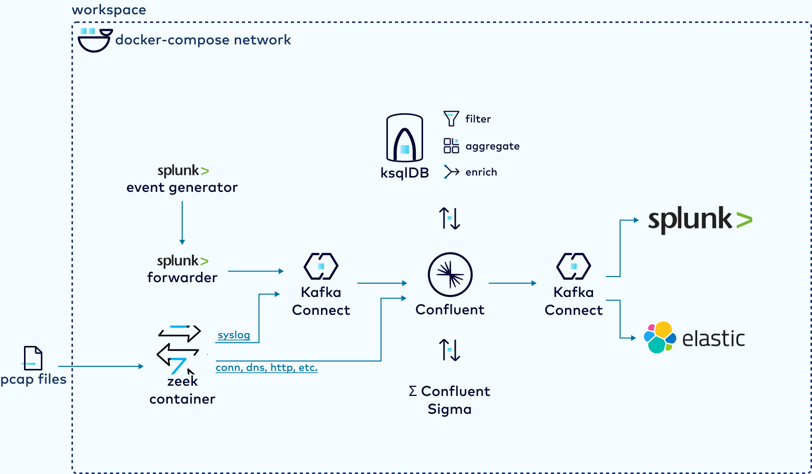

# Executive Demonstration

You are a Confluent employee showcasing this demo for an executive audience.

## Presentation

1. Request read access to the [demo presentation](https://docs.google.com/presentation/d/1fRue23OSV_zddkXWOv4YOARvK1SHAOkffcFzms0RBsk/edit?usp=sharing)
2. Deliver the slide presentation to set the context

## Demonstration Short Version

If you don't want to run through the manual steps, then launch the workspace in "demo mode" so all components and connectors are already running.

Launch the Gitpod workspace by clicking the link:
- https://gitpod.io/#DEMO_MODE=true/https://github.com/confluentinc/demo-siem-optimization

Things to highlight:
- Confluent Sigma on port 8080
- Confluent Control Center on port 9021
  - topics
  - connectors
  - ksql queries

# Demonstration Script

Keep this guide open on a separate screen so you can refer to it throughout the demo. It is suggested to can go to GitHub to benefit from code copy button functionality.
- https://github.com/confluentinc/demo-siem-optimization/instructions/00-executive-demo.md

1. In a screen you are displaying to your audience, launch the Gitpod workspace by clicking the link:
   - https://gitpod.io/#https://github.com/confluentinc/demo-siem-optimization

> Here I'm starting a containerized lab environment that will automatically do a lot on launch.

> I am going to demonstrate how Confluent can help you optimize your existing SIEM investment, while at the same time improving your cyber defense capabilities.

2. Display this architecture diagramfor your audience:

    

> In this demonstration, we take the role of a company that uses Splunk as its SIEM solution. We already have Splunk agents in place and potentially other tools like rsyslog or Zeek/Corelight. Before Confluent, all of this data was either being dropped, or going straight into Splunk.

>  This demo will show four advantages of using Confluent: 
>1. Real-time threat detection directly in the streams of data.
>2. Decrease your Splunk costs by filtering and aggregating the data before it lands in Splunk.
>3. Gain insights from high volume data too expensive to index
>4. Avoid vendor lock-in so that you can take advantage of the strengths of different SIEM vendors.

## Explore Control Center

Back in Gitpod, open Confluent Control Center by launching a new tab for port `9021` from Remote Explorer (see [Gitpod tips](./gitpod-tips.md)).

> What you are seeing here are a number of topics that already exist in this newly spun up environment. Topics are how different streams of data are organized.  Most of these topics are receiving PCAP data streaming in through a Zeek container. Zeek is a common tool in cyber defense -- it's an open source network sensor that reads packet traffic and produces metadata about that activity on the network.  For instance you can see topics for socket connections, dns queries, http requests, running applications, etc. Zeek is a good example of one of the many tools in this domain that have native support for producing directly into Confluent. Other examples are things like syslog-ng, r-syslog, beats, blue coat proxy, etc.

> We also have some precreated topics that will be used by our real-time stream processors. One of those for instance is topic with domain name watch lists. But we'll look at that later.

## Demonstrate the Ease of Importing Data into Confluent

### Add the `SyslogSourceConnector`

> Confluent offers a buffet of off-the-shelf connectors to easily get data in or our of event streams.  A standard data source in Cyber defense are system logs (syslog), so lets start capturing that.

1. Navigate to the connect cluster in Confluent Control Center.
2. Select "add connector"
3. Select "SyslogSourceConnector"

> If you aren’t familiar with Kafka Connect, it's the easiest way to move data into or out of Confluent. You simply specify a few settings for the external system, and the connect cluster automatically starts the data flowing. No code required.

4. Set `syslog.listener` to `UDP` and `syslog.port` to `5140`.

> All I have to do with this connector is to specify which syslog protocol to use and which port to receive events on.

5. Submit the connector.

> Control center actually generates the configuration and sends it to the Connect cluster's REST API. So you can just as easily automate this using your favorite tool, or use gitops to store the connectors you need.

### Add the `SplunkS2SSourceConnector`

>As mentioned earlier, we are a company that has Splunk agents to collecting and sending data straight to Splunk.  In order to take advantage of real-time stream processing, we want to send the data to Confluent instead.  So let's spin up another connector to receive this data.

1. Click "add connector" and select the `SplunkS2SSourceConnector`.
2. Submit the connector.

> For this one we don’t need to specify anything at all and will just stick with the defaults.

> So at this point let's actually go back and take a quick peek into the topics to see what the data looks like.

3. Inspect the records in the `syslog` topic.

> Note that Confluent syslog connector parses and extracts the syslog into a structured format but also includes the raw syslog string as well.  This turns out to be important because many tools in the cyber defense ecosystem understand or want raw syslog and this way it doesn’t need to be reconstructed

4. Inspect the records in the `splunk-s2s-events` topic.

> Take a quick peek at the data coming from the splunk universal forwarder. You can see that it's doing something similar to the syslog connector. It has some structure and the original Splunk data.

### View Network Metadata from Zeek

> There is another source of data captured for this demo -- a Zeek network sensor. This network metadata data was captured from an exfiltration exercise and stored in a PCAP file. That file is then streamed into Confluent through a Kafka producer to simulate an obscenely high volume captured in real time. In the real world, the Zeek sensor would send data to a Kafka producer, which would publish to topics in real time. Again, Zeek is producing data about socket connections, dns queries, http requests, running applications, etc. Let's look at the DNS data.

1. Inspect reords in the `dns` topic.

>  The volume of DNS data is shockingly high.  In the Pantheon of cyber data volumes, only pure packet capture and netflow data tends to be bigger. Organizations often don’t even send it to their SIEM because it's cost is prohibitive and places a huge burden on the SIEM relative to other data sources.  This data is generally just hard to deal with.  The immediate consequence is bad guys know this and it's a favorite for things like SSH tunneling and data exfiltration.

## Analyze Streaming SIEM Data in Real Time

> Lets go to ksqlDB in Control Center.  If you are not familiar with ksqlDB, its a stream processing engine that allows you to leverage simple SQL syntax to do some very powerful real-time processing.

1. Go to the ksqlDB app in Control Center. Make sure `auto.offset.reset=earliest` so queries pick up from the beginning of topics.

> So we have three sources of data at this point:
>1. Syslog data flowing from agents into Confluent via the SyslogSourceConnector
>2. Data from Splunk agents flowing into Confluent via the Splunks2sSourceConnector
>3. High volume network metadata taken from a Zeek sensor.

> High-volume, low-value data is costly to index in SIEM tools. SIEMs like Splunk are optimized for indexing and searching, so there are performance and budget costs for sending more data than necessary. Unfortunately that means this data is usually dropped altogether. But what if you could filter and aggregate the data in motion _before_ it gets to the SIEM indexing tool? You would save on costs while still deriving value from that high volume data.

> Organizations are looking to respond more rapidly to threat patterns and automate as much as possible (SOAR -- Security Orchestration Automated Response). Confluent's event-driven, data in motion paradigm is practically purpose built for this sort of demand.

### Filter and Enrich the DNS Stream

> Let's use Confluent to optimize your data and look for threats upstream of your SIEM. We're going to use Confluent's stream processing database ksqlDB to filter, enrich, and aggregate these data streams in real-time. 

2. Create the `conn_stream` in the KSQL editor.

    ```sql
    CREATE STREAM conn_stream (
        ts DOUBLE(16,6), 
        uid STRING, 
        "id.orig_h" VARCHAR, 
        "id.orig_p" INTEGER, 
        "id.resp_h" VARCHAR, 
        "id.resp_p" INTEGER, 
        proto STRING, 
        service STRING, 
        conn_state STRING, 
        local_orig BOOLEAN, 
        local_resp BOOLEAN, 
        missed_bytes INTEGER, 
        history STRING, 
        orig_packets INTEGER, 
        orig_ip_bytes INTEGER, 
        resp_pkts INTEGER, 
        resp_ip_bytes INTEGER) 
    WITH (KAFKA_TOPIC='conn', VALUE_FORMAT='JSON');
    ```

> The first thing we need to do is tell ksqlDB how to interpret the raw JSON data thats coming in from Zeek into our topics. I’m not going to walk through all the details of these queries, but you can see its assigning data types to the fields in the topics. This stream is socket connection data.

> Similarly, we structure the stream for DNS data captured by Zeek.

3. Create the `dns_stream` in the KSQL editor.

    ```sql
    CREATE STREAM dns_stream ( 
        ts DOUBLE(16,6), 
        uid STRING, 
        "id.orig_h" VARCHAR, 
        "id.orig_p" INTEGER, 
        "id.resp_h" VARCHAR, 
        "id.resp_p" INTEGER, 
        proto STRING, 
        trans_id INTEGER, 
        "query" VARCHAR, 
        qclass INTEGER, 
        qclass_name VARCHAR, 
        qtype INTEGER, 
        qtype_name STRING, 
        rcode INTEGER, 
        rcode_name STRING, 
        AA BOOLEAN, 
        TC BOOLEAN, 
        RD BOOLEAN, 
        RA BOOLEAN, 
        Z INTEGER, 
        answers array<VARCHAR>, 
        TTLs array<DOUBLE(5,1)>, 
        rejected BOOLEAN) 
    WITH (KAFKA_TOPIC='dns', VALUE_FORMAT='JSON');
    ```

> At this point we can start processing, and analyzing.  So for instance if I wanted to get a real-time aggregation as the data flows through kafka I could run a query like this:

4. Submit the KSQL query and terminate when ready to move on.

    ```sql
    SELECT "query", COUNT("query") AS LOOKUPS
        FROM DNS_STREAM
        GROUP BY "query"
        EMIT CHANGES;
    ```

> This is giving me a count broken down by unique DNS queries. Note that as time goes on the repeat queries will have larger numbers and this will go on indefinitely until you terminate the query.  In actuality these sort of real-time aggregates need something called a window to be useful. for instance I might say I want a running count in 10 second windows and any time I see the same query more than X in 10 seconds that could be interesting. This is just an ad-hoc query. It will terminate when I'm tired of looking at it.

> Lets actually create an enriched and filtered stream of DNS data.  For every DNS query there is of course a network connection.  The zeek sensor has a separate stream for ALL connections which includes the DNS ones.  If I really wanted a more complete view of the DNS queries I probably need to join the streams, for instance maybe I want the transferred bytes associated with the query.  That's not in DNS but is in Connection.   So let's create a persistent query which will produce the enriched data. This query will live on and continue to process records in real-time.

5. Submit the persistent query.

    ```sql
    CREATE STREAM RICH_DNS
    WITH (PARTITIONS=1, VALUE_FORMAT='JSON')
    AS SELECT d."query", 
            d."id.orig_h" AS SRC_IP, 
            d."id.resp_h" AS DEST_IP,
            GETGEOFORIP(D.`id.resp_h`) DEST_GEO,
            d."id.orig_p" AS SRC_PORT, 
            d."id.resp_h" AS DEST_PORT, 
            d.QTYPE_NAME, 
            d.TTLS, 
            d.ANSWERS, 
            d.TS, 
            d.UID, 
            c.UID, 
            c.ORIG_IP_BYTES AS REQUEST_BYTES, 
            c.RESP_IP_BYTES AS REPLY_BYTES, 
            c.LOCAL_ORIG 
        FROM DNS_STREAM d INNER JOIN CONN_STREAM c
            WITHIN 1 MINUTES
            ON d.UID = c.UID
        WHERE LOCAL_ORIG = true
        PARTITION BY "query"
    EMIT CHANGES;
    ```

> Note that in addition to joining to the connection stream for byte tallies, I’m also calling a custom function that uses maxmind to get the geo location for the IP AND filtering out anything that did not originate on the local network.

> We can now peek at the new enriched stream.

6. Submit query to inspect the new derived stream.

    ```sql
    SELECT * FROM RICH_DNS EMIT CHANGES;
    ```
>  Here is the enriched and filtered stream with byte tallies and geospatial data. And now any SIEM tool can take advantage of it. Pretty cool!

### Real-Time Watchlist Alerts


> Now that we have filtered and enriched this DNS data, let's apply some real-time alerting to it in Confluent. It's common for SOCs (Security Operations Centers) to maintain watchlists for IP addresses and domains.

> We already have such a watchlist populated in a Kafka topic, so we can now populate a lookup table in ksqlDB.

1. Set the ksqlDB editor's `auto.offset.reset` to `earliest` so the watchlist table will be populated from the beginning of the topic.

2. Create the `DOMAIN_WATCHLIST` lookup table.
    ```sql
    CREATE TABLE DOMAIN_WATCHLIST (
        domain VARCHAR PRIMARY KEY,
        id STRING,
        dateadded STRING,
        source VARCHAR)
    WITH (KAFKA_TOPIC='adhosts', VALUE_FORMAT='AVRO');
    ```
>  Now we can create a query that emits events for any DNS lookups against domain names in the watchlist.

3. Create the persistent query.

    ```sql
    CREATE STREAM MATCHED_DOMAINS_DNS
    WITH (KAFKA_TOPIC='matched_dns', PARTITIONS=1, REPLICAS=1)
    AS SELECT *
        FROM RICH_DNS INNER JOIN DOMAIN_WATCHLIST
        ON RICH_DNS."query" = DOMAIN_WATCHLIST.DOMAIN
    EMIT CHANGES;
    ```
> Now every time a DNS request goes to a domain in the watchlist, an event will be emitted to the `matched_dns` topic, where any other service can listen and take action. Not only that, but the watchlist table will update in real time as new records arrive in the `adhosts` topic.

> Let's see if we are getting any watchlist matches.

4. Select from the stream.

    ```sql
    SELECT * FROM MATCHED_DOMAINS_DNS
    EMIT CHANGES
    LIMIT 2;
    ```

> These results could be sent to the SOAR of your choice for immediate action.

### Real-Time Authentication Alerts with DUO (Skip)

<---> This section is under construction. Skip for now. <--->

> We will take a look at one more example of creating an alert. We also have DUO data simulating multi-factor and that writing to the duo topic. Suppose we wanted to create an alert that would notify an analyst if there were repeated sign in failures, but not just any sign in failure as your MFA tool would most likely catch that. In this case, we will be looking for multiple failures that occur within a window of time, perhaps by a bot that is changing their IP address.

1. Create the stream of DUO events.

    ```sql
    CREATE STREAM duo_stream (
    Time_Auth VARCHAR,
    User VARCHAR,
    Integration VARCHAR,
    Factor VARCHAR,
    Result VARCHAR,
    Reason VARCHAR,
    TWO_FA_Device_Name VARCHAR,
    Access_Device_IP VARCHAR,
    Access_Device_Country VARCHAR,
    Access_Device_State VARCHAR,
    Access_Device_City VARCHAR,
    Email VARCHAR,
    Response_Time VARCHAR
    ) WITH (KAFKA_TOPIC='duo', VALUE_FORMAT='DELIMITED', VALUE_DELIMITER=',');
    ```

> Next, we count up the failures within 30 second windows.

2. Create the windowed count of failed login attempts.
    ```sql
    CREATE TABLE DUO_FAILURES
    WITH (PARTITIONS=1, VALUE_FORMAT='AVRO')
    AS SELECT 
        WINDOWSTART AS WS, 
        WINDOWEND AS WE, 
        COUNT(*) AS COUNT, 
        RESULT 
        FROM DUO_STREAM 
        WINDOW TUMBLING (SIZE 30 SECONDS)
        WHERE RESULT = 'FAILURE'
        GROUP BY RESULT
        EMIT CHANGES;
    ```

> And then, we create the alert stream that will trigger if there are more than 10 failures within that 30 second tumbling window.

3. Create the failures and suspicious failure rate streams.
    ```sql
    CREATE STREAM FAILURES_STREAM
    WITH (KAFKA_TOPIC='DUO_FAILURES', VALUE_FORMAT='AVRO');
    
    CREATE STREAM SUSPICIOUS_FAILURE_RATE
    WITH (PARTITIONS=1, VALUE_FORMAT='AVRO')
    AS SELECT *
        FROM FAILURES_STREAM
        WHERE (FAILURES_STREAM.COUNT > 10)
    EMIT CHANGES;
    ```

4. View the suspicious failure rate stream and stop the query when you're done.
    ```sql
    SELECT * FROM SUSPICIOUS_FAILURE_RATE EMIT CHANGES;
    ```

> Like before, your SOAR can listen to these events and take immediate action.

## Apply Sigma Rules in Real-Time with Confluent Sigma

1. Go to the [Confluent Sigma slide](https://docs.google.com/presentation/d/1fRue23OSV_zddkXWOv4YOARvK1SHAOkffcFzms0RBsk/edit#slide=id.g102ab69693c_0_4511) in the presentation.

> In working with my many cyber defense customers, one thing I realized is that very few of the SOC personnel are coders, and even SQL can be out of their comfort zone. They are focused on understanding their domain and their toolset. That's why we created Confluent Sigma, an open-source stream processing application with a UI for security professionals.

2. Open the Confluent Sigma UI on port `8080` in a new tab from Remote Explorer (see [Gitpod tips](./gitpod-tips.md)).

> We wrote Confluent Sigma using Kafka Streams, which is a poorly named but powerful stream processing library for Java.  ksqlDB actually runs on Kafka Streams "under the hood." As a Java library, Kafka Streams gives deeper programmatic control over your stream processing logic, which in this case we used to create a custom application. To understand what it does, we need to know what Sigma is in the SIEM world.

3. Show the https://github.com/SigmaHQ/sigma page.

> Sigma is a domain-specific language (DSL) to describe suspicious patterns in log events. It's open source, and security researchers maintain collections of Sigma patterns to share with others.

4. Go back to the Confluent Sigma UI tab.

> What you are seeing here is a simple web interface for the Confluent Sigma. I mentioned earlier that the data being sent into Confluent in this demonstration was taken during a data exfiltration exercise.  You may also remember that I said DNS was a favorite channel for exploitation by baddies.  So let's see if we can develop a sigma rule to exposes this.  Data exfiltration likely means that someone has a bot or trojan inside our network and they want to send data out to a collecting server. One innocuous way to do this is make legitimate DNS queries from the trojan but encode the data in the DNS query.

5. Go to the "Sigma Rules" tab and paste the rule. Click the "publish" button when ready. Show the rule in "Sigma Rules".
    ```yml
    title: Possible DNS exfiltration
    status: test
    description: 'This rule identifies possible data exfiltration through DNS'
    author: Will LaForest
    logsource:
      product: zeek
      service: dns
    detection:
      query_length:
        query|re: ^.{180}.*$
      condition: query_length
    ```

> What you are seeing here is a rule that is looking for any dns queries that are longer than 180 characters as that would be somewhat suspicious.  When I hit the publish button that is going to be sent into a Kafka topic and picked up by the sigma stream processor which will start looking for that pattern in the DNS topic.

6. Go to the DNS tab.

> The sigma streams processor is currently configured to put any matching records into a new topic called `dns-detection`. As you can see there is nothing in there.  This means nothing is matching.  Actually I can go back to my sigma UI and click on the DNS Data tab and see that gray represents record flow in the topic and red represents detections.

> So if there is a bot sending data out they aren’t dumb enough to use big long suspicious queries.  We will make it preposterously low to demonstrate that its working at all.

7. Edit the rule to change 180 to 8, publish, and go back to the DNS tab.

> You can now see that pretty much every DNS record matches which is what we would expect.  Let's set it back to 180 and let's publish a different new rule.

8. Edit the rule to change 8 back to to 180, publish, and go back to the DNS tab.

> If the bot isn’t publishing long queries then it's clearly keeping them more modest so that it will fly under the radar.  In this case we are looking for queries over 50 characters which are not rare but only key in on them IF you see more than 10 of them in a 5 second window.

9. Publish a new rule and then return to the DNS tab.
    ```yml
    title: Possible DNS exfiltration over Time
    status: test
    description: 'This rule identifies possible data exfiltration through DNS'
    author: Will LaForest
    logsource:
      product: zeek
      service: dns
    detection:
      query_length:
        query|re: ^.{50}.*$
      condition: query_length | count() > 10
      timeframe: 5s
    ```

