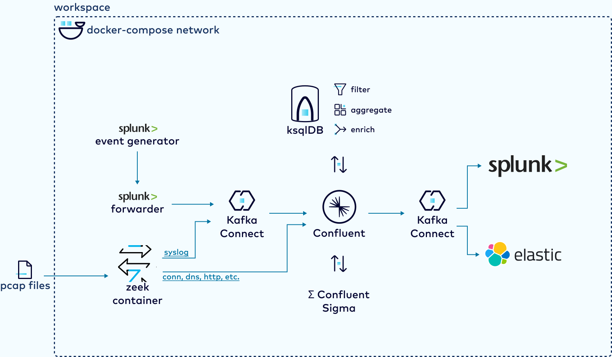

# Optimize SIEM With Confluent

Confluent can optimize your SIEM solution by addressing three main factors:
- **Scale**: Capture and curate data at wire speed and petabyte scale across distributed environments that conventional ingest approaches cannot keep up with
- **Speed**: Detect, filter and enrich data to deliver real-time situational awareness, reduce false positives and respond to incident and threats faster
- **Cost**: Avoid vendor lock-in from expensive proprietary tools and utilize a tiered data model to minimize software and infrastructure costs

## Demo Lab Environment

This lab environment is a network of Docker containers. There is a Splunk event generator feeding data to the Universal Forwarder. There is also a container that uses PCAP files to simulate network traffic that is sniffed by Zeek. The Splunk events and syslog events are streamed into topics on the Confluent Server (which is a Kafka broker) via Kafka Connect source connectors. Socket connection, DNS, HTTP, and other network data sniffed by Zeek is produced directly to the broker using an open source Zeek-Kafka plugin. ksqlDB and Confluent Sigma are stream processors that filter, aggregate, and enrich data in motion. The optimized data is sent via Kafka Connect sink connectors to Splunk or Elastic for indexing and analysis.

## Explore

1. Open Confluent Control Center by launching a new tab for port `9021` from Remote Explorer (see [Gitpod tips](./gitpod-tips.md)). Browse the various pages like topics and connect.

2. In the repo, browse `.gitpod.yml` to get a sense of what runs on launch and what is happening on various ports. Similarly, browse `docker-compose.yml` to get a sense of what different containers are doing.

## What next?

Go to 